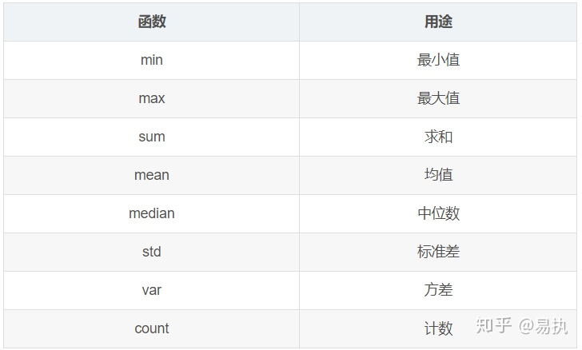

# Pandas

[TOC]


## 快速入门

### 数据结构简介

```
import numpy as np
import pandas as pd
```

### Series

`Series`是带标签的一维数组，可存储整数、浮点数、字符串、Python 对象等类型的数据。轴标签统称为**索引**。调用 `pd.Series` 函数即可创建 Series：

```
s = pd.Series(data, index=index)
#index是列表，轴标签列表,默认是数值型索引
#Series 的数据类型一般是 NumPy 数据类型。
s.index
s.dtype
s.array #(opens new window)用于提取 Series 数组。
s.to_numpy() #提取真正的多维数组，要用 Series.to_numpy()
```

#### 多维数组

#### 字典

```python
In [7]: d = {'b': 1, 'a': 0, 'c': 2}

In [8]: pd.Series(d)
Out[8]: 
b    1
a    0
c    2
dtype: int64
#Pandas 用 NaN（Not a Number）表示缺失数据。
```

#### Series 类似多维数组

```
In [13]: s[0]
Out[13]: 0.4691122999071863

In [14]: s[:3]
Out[14]: 
a    0.469112
b   -0.282863
c   -1.509059
dtype: float64

In [15]: s[s > s.median()]
Out[15]: 
a    0.469112
e    1.212112
dtype: float64

In [16]: s[[4, 3, 1]]
Out[16]: 
e    1.212112
d   -1.135632
b   -0.282863
dtype: float64

In [17]: np.exp(s)
Out[17]: 
a    1.598575
b    0.753623
c    0.221118
d    0.321219
e    3.360575
dtype: float64
```

#### Series 类似字典

```
s['a']
s['e'] = 12
'e' in s
```

#### 矢量操作与对齐 Series 标签

```
s + s
s * 2
np.exp(s)
```

#### 名称属性

```
Series 支持 name 属性
In [32]: s = pd.Series(np.random.randn(5), name='something')

In [33]: s
Out[33]: 
0   -0.494929
1    1.071804
2    0.721555
3   -0.706771
4   -1.039575
Name: something, dtype: float64

In [34]: s.name
Out[34]: 'something'
s.rename("different")
```

### DataFrame

**DataFrame** 是由多种类型的列构成的二维标签数据结构

#### 用 Series 字典或字典生成 DataFrame

```python
d = {'one': pd.Series([1., 2., 3.], index=['a', 'b', 'c']), 'two': pd.Series([1., 2., 3., 4.], index=['a', 'b', 'c', 'd'])}
df = pd.DataFrame(d, index=[], columns=[])
df.index
df.columns
```

#### 用多维数组字典、列表字典生成 DataFrame

```
d = {'one': [1., 2., 3., 4.], 'two': [4., 3., 2., 1.]}
```

#### 用结构多维数组或记录多维数组生成 DataFrame

#### 用列表字典生成 DataFrame

```
data2 = [{'a': 1, 'b': 2}, {'a': 5, 'b': 10, 'c': 20}]
pd.DataFrame(data2)
pd.DataFrame(data2, index=['first', 'second'])
pd.DataFrame(data2, columns=['a', 'b'])
```

#### 用元组字典生成 DataFrame

#### 提取、添加、删除列

```
df['one']
df['three'] = df['one'] * df['two']
df['flag'] = df['one'] > 2
```

##### 删除（del、pop）列的方式也与字典类似：

```
del df['two']
three = df.pop('three')
#标量值以广播的方式填充列
df['foo'] = 'bar'
#插入与 DataFrame 索引不同的 Series 时，以 DataFrame 的索引为准：
df['one_trunc'] = df['one'][:2]
```

##### 插入

```
df.insert(1, 'bar', df['one']) #位置，columns名字， 插入的列
iris.assign(sepal_ratio=iris['SepalWidth'] / iris['SepalLength'] #返回的是数据副本，原dataframe不变
dfa.assign(C=lambda x: x['A'] + x['B'],
            D=lambda x: x['A'] + x['C'])
```

#### 索引选择

| 操作             | 句法                       | 结果      |
| ---------------- | -------------------------- | --------- |
| 选择列           | `df[col]`                  | Series    |
| 用标签选择行     | `df.loc[label]`            | Series    |
| 用整数位置选择行 | `df.iloc[loc]`（简直无敌） | Series    |
| 行切片           | `df[5:10]`                 | DataFrame |
| 用布尔向量选择行 | `df[bool_vec]`             | DataFrame |

`df.describe()`

`df.T`倒置



```
#groupby 分类
data.groupby('company').agg({'salary':'median','age':'mean'})
#agg功能
#transform现在需要在原数据集中新增一列avg_salary，代表员工所在的公司的平均薪水（相同公司的员工具有一样的平均薪水）
data['avg_salary'] = data.groupby('company')['salary'].transform('mean')
#apply
```

### 三板斧

```
map
#1 字典映射
data["gender"] = data["gender"].map({"男":1, "女":0})
#2 函数实现
def gender_map(x):
    gender = 1 if x == "男" else 0
    return gender
#注意这里传入的是函数名，不带括号
data["gender"] = data["gender"].map(gender_map)
```

```
apply
#年龄age列有较大误差，需要对其进行调整（加上或减去一个值），由于这个加上或减去的值未知，故在定义函数时，需要加多一个参数bias

def apply_age(x,bias):
    return x+bias

#以元组的方式传入额外的参数
data["age"] = data["age"].apply(apply_age,args=(-3,))

axis = 1 按行进行操作
axis = 0 按列进行操作
```

```
applymap
applymap的用法比较简单，会对DataFrame中的每个单元格执行指定函数的操作
df.applymap(lambda x:"%.2f" % x)
```

